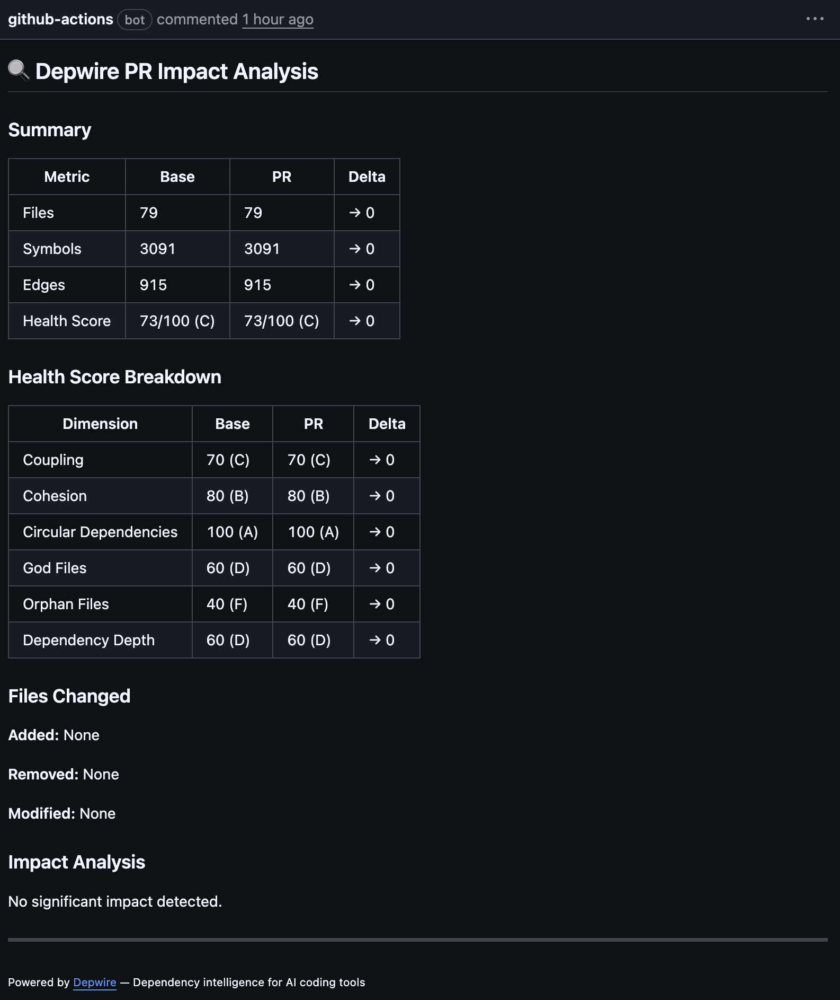

# Depwire PR Impact Analysis

[](https://github.com/marketplace/actions/depwire-pr-impact)
[](https://github.com/depwire/depwire-action/releases)
[](LICENSE)

**Automatically analyze dependency changes, health score delta, and architecture impact on every pull request.**

When a developer opens or updates a PR, this action compares the base branch to the PR branch, analyzes the dependency graph, calculates health score changes, and posts a detailed markdown comment with impact analysis — helping teams catch architectural issues before merge.



---

## Quick Start

Create `.github/workflows/depwire.yml` in your repository:

```yaml
name: Depwire PR Impact
on:
  pull_request:
    branches: [main]

permissions:
  contents: read
  pull-requests: write

jobs:
  depwire:
    runs-on: ubuntu-latest
    steps:
      - uses: actions/checkout@v4
        with:
          fetch-depth: 0   # Required for base branch comparison
      
      - uses: actions/setup-node@v4
        with:
          node-version: '20'
      
      - uses: depwire/depwire-action@v1
        with:
          github-token: ${{ secrets.GITHUB_TOKEN }}
```

That's it! Every PR will now get an automated comment showing:

- **Summary Table** — Files, symbols, edges, and health score before/after with deltas
- **Health Score Breakdown** — 6 dimensions (Coupling, Cohesion, Circular Deps, God Files, Orphan Files, Depth)
- **Files Changed** — Added, removed, modified files with symbol counts
- **Impact Analysis** — Risk assessment for each changed file (high/medium/low risk based on connections)
- **New Dependencies** — Edges added by the PR

---

## What It Reports

### Summary Table
| Metric | Base | PR | Delta |
|--------|------|-----|-------|
| Files | 45 | 48 | ↑ +3 |
| Symbols | 523 | 589 | ↑ +66 |
| Edges | 159 | 178 | ↑ +19 |
| Health Score | 78/100 (C) | 81/100 (B) | ↑ +3 |

### Health Score Breakdown
6 dimensions with before/after scores and deltas:
- **Coupling** — Module interconnection density
- **Cohesion** — File focus and responsibility clarity
- **Circular Dependencies** — Import cycle detection
- **God Files** — Large file detection (high symbol count)
- **Orphan Files** — Disconnected code identification
- **Depth** — Dependency tree depth analysis

### Files Changed
Lists added, removed, and modified files with symbol and edge counts.

### Impact Analysis
Risk assessment table showing:
| File | Risk | Connections | Reason |
|------|------|-------------|--------|
| `src/index.ts` | ⚠️ High | 28 | Hub file modified — changes affect 28 connected files |
| `src/auth/oauth.ts` | ✅ Low | 0 | New file, no existing dependents |

### Powered by Depwire
Every comment includes a footer link to [Depwire](https://depwire.dev) for local CLI usage.

---

## Inputs

| Input | Description | Required | Default |
|-------|-------------|----------|---------|
| `github-token` | GitHub token for posting PR comments | Yes | `${{ github.token }}` |
| `path` | Path to the project to analyze (relative to repo root) | No | `.` |
| `depwire-version` | Version of `depwire-cli` to use | No | `latest` |
| `fail-on-score-drop` | Fail the action if health score drops by more than this amount | No | `0` |
| `show-diagram` | Include arc diagram in PR comment (future feature) | No | `true` |
| `comment-header` | Custom header for the PR comment | No | `## 🔍 Depwire PR Impact Analysis` |

---

## Outputs

| Output | Description |
|--------|-------------|
| `health-score` | Current health score (0-100) |
| `health-grade` | Current health grade (A-F) |
| `health-delta` | Change in health score from base branch |
| `files-changed` | Total number of files added, removed, or modified |

---

## Advanced Usage

### Fail PR if Health Score Drops

Enforce a minimum health score threshold to block PRs that degrade code quality:

```yaml
- uses: depwire/depwire-action@v1
  with:
    github-token: ${{ secrets.GITHUB_TOKEN }}
    fail-on-score-drop: 5
```

If the health score drops by more than 5 points, the action will fail and block the PR merge.

### Monorepo: Analyze Specific Package

For monorepos, analyze a specific subdirectory:

```yaml
- uses: depwire/depwire-action@v1
  with:
    github-token: ${{ secrets.GITHUB_TOKEN }}
    path: packages/backend
```

### Pin Depwire CLI Version

Lock to a specific version of `depwire-cli` for reproducible builds:

```yaml
- uses: depwire/depwire-action@v1
  with:
    github-token: ${{ secrets.GITHUB_TOKEN }}
    depwire-version: '1.2.3'
```

### Use Outputs in Subsequent Steps

Access the health score and other metrics in later workflow steps:

```yaml
- uses: depwire/depwire-action@v1
  id: depwire
  with:
    github-token: ${{ secrets.GITHUB_TOKEN }}

- name: Check health score
  run: |
    echo "Health score: ${{ steps.depwire.outputs.health-score }}"
    echo "Grade: ${{ steps.depwire.outputs.health-grade }}"
    echo "Delta: ${{ steps.depwire.outputs.health-delta }}"
    
    if [ ${{ steps.depwire.outputs.health-delta }} -lt 0 ]; then
      echo "⚠️ Health score decreased!"
    fi
```

---

## How It Works

1. **Install Depwire CLI** — `npm install -g depwire-cli`
2. **Analyze PR branch** — Parse and calculate health score
3. **Checkout base branch** — Switch to the target branch (e.g., `main`)
4. **Analyze base branch** — Parse and calculate health score
5. **Compute diff** — Compare files, symbols, edges, and health scores
6. **Analyze impact** — Flag high-risk changes (files with 20+ connections)
7. **Build markdown comment** — Format results as clean tables
8. **Post or update comment** — Avoids duplicates by updating existing comments

The action runs `depwire parse` and `depwire health` on both branches, computes the delta, and generates a comprehensive report.

---

## What Is Depwire?

[Depwire](https://depwire.dev) is a **dependency intelligence tool** for modern codebases.

It parses your code (TypeScript, JavaScript, Python, Go), builds a cross-reference graph, and calculates a **health score** across 6 dimensions:

- **Coupling** — how tightly connected your modules are
- **Cohesion** — how focused each file is
- **Circular Dependencies** — import cycles that create fragility
- **God Files** — oversized files that do too much
- **Orphan Files** — disconnected code that may be dead
- **Depth** — how many layers deep your dependency tree goes

Depwire is designed for **AI coding tools** — it gives AI agents the context they need to understand your architecture before making changes.

### Local Usage

Install `depwire-cli` locally to run the same analysis on your machine:

```bash
npm install -g depwire-cli

depwire parse .
depwire health .
depwire impact src/auth/index.ts
depwire viz .
```

See [github.com/depwire/depwire](https://github.com/depwire/depwire) for full documentation.

---

## License

This action is licensed under the [Business Source License 1.1](LICENSE).

**Free for:**
- Personal use
- Open source projects
- Companies with <$1M annual revenue

**Paid license required** for larger commercial use. See [depwire.dev/pricing](https://depwire.dev/pricing).

---

## Support

- **Issues**: [github.com/depwire/depwire-action/issues](https://github.com/depwire/depwire-action/issues)
- **Documentation**: [github.com/depwire/depwire](https://github.com/depwire/depwire)
- **Discussions**: [github.com/depwire/depwire/discussions](https://github.com/depwire/depwire/discussions)

---

<sub>Powered by [Depwire](https://depwire.dev) — install `npm install -g depwire-cli` for local analysis</sub>
